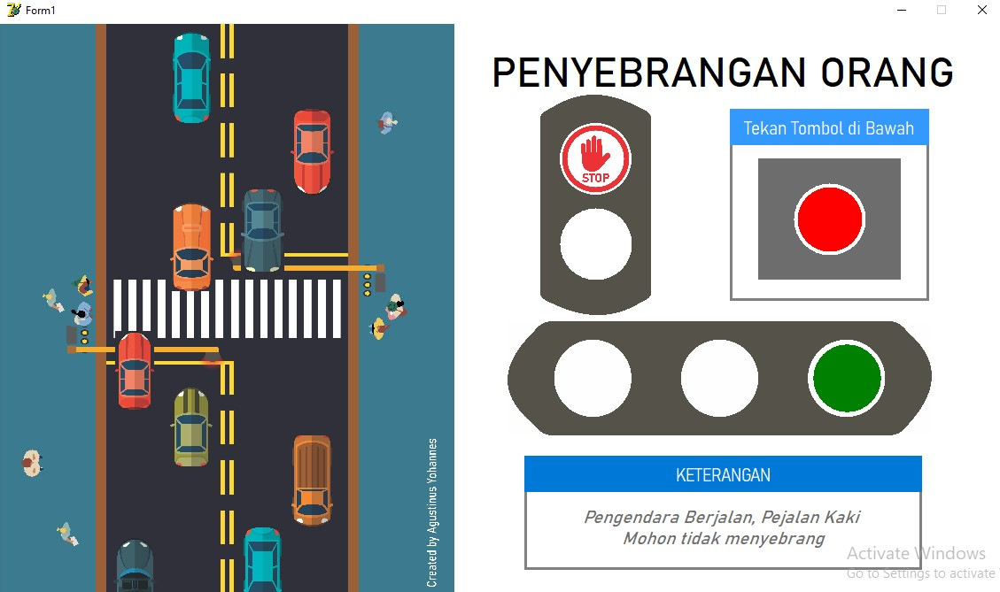
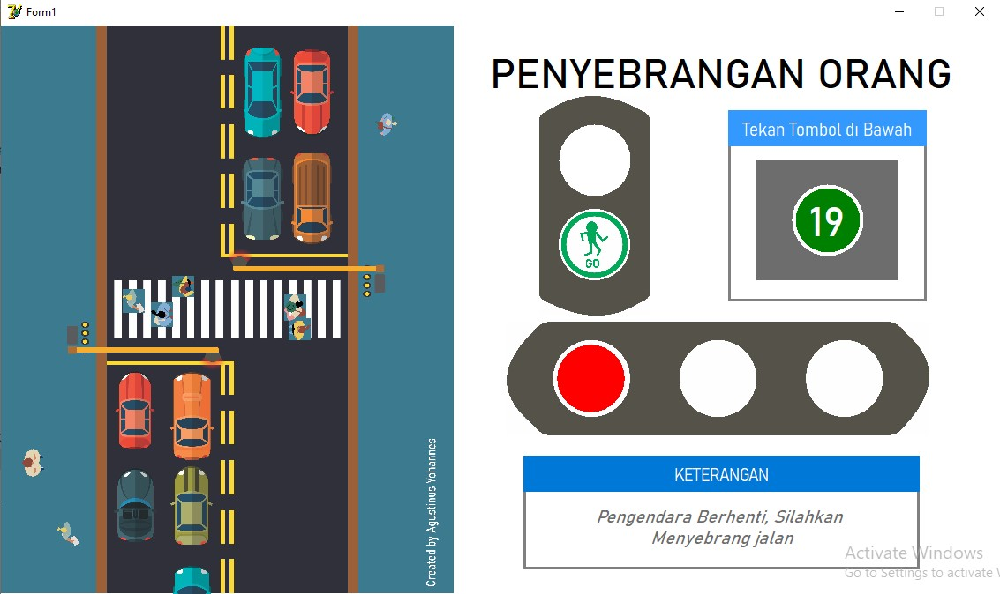

# Delphi-Animasi-Penyebrangan-Orang
Animasi Penyebrangan Orang dengan Timer pada Delphi

Lampu Pejalan Kaki Merah

Lampu Pejalan Kaki Hijau

## Komponen
- Button
- Label
- Shape
- Picture
- Timer

### Fitur
1. Lalu lintas 2 jalur 4 ruas
2. 8 Kendaraan yang memiliki kecepatan berbeda
3. Delay perubahan warna lampu dari hijau ke merah dengan lampu kuning
4. Kendaraan otomatis berjalan dengan kecepatan random setelah pejalan menyebrang

### Alur Logika
> - Ketika lampu untuk pejalan kaki bewarna merah, lampu untuk pengendara bewarna hijau, pengendara berjalan, pejalan kaki diam
> - Ketika tombol penyebrangan ditekan, lampu kuning berkedip 3 kali kemudian, lampu untuk pengendara bewarna merah dan lampu penyebrangan bewarna hijau
> - Ketika kendaraan berhenti ddimunculkan delay 30 detik dengan indikator, kendaraan berhenti di belakang zebra cross, dan pengendara menyebrang jalan
> - Setelah waktu menjadi 0 detik, lampu penyebrangan menjadi merah, lampu untuk pengendara berubah hijau.
> - Kendaraan kembali berjalan, dan pejalan kaki kembali ke titik awal.

#### Kritik dan saran dipersilahkan :D